# Team & Project Intro

> Team:

- Hanan
- Jodie
- Jasmine
- Caitlyn
- Amun
- Aga

> Project:

**Project Concept:** ReadSwap is a platform that aims to address the challenge of unused and idle books by facilitating book exchange, sale, or gifting among book enthusiasts. It encourages sustainable reading practices and minimizes book waste by allowing users to unlock the full potential of their book collections.

**Who will this help:** ReadSwap will benefit individuals who still value the tactile experience of reading paper books and wish to share, exchange, sell, or gift their books with others. It also caters to book enthusiasts in search of rare and out-of-print books, fostering a vibrant community of like-minded readers.

**The tools to be used:** The ReadSwap platform can be developed using various web development tools and technologies, such as HTML, CSS, JavaScript, and a back-end programming language like Node.js or Python. Additionally, a database system like MySQL may be employed to manage book listings and user information. User authentication and security features should also be implemented to ensure a safe and seamless experience for all users.

**The tasks division:** 
**Time Frame: 27 days**

This section will be adjusted as the project progresses.

1. Hanan:
   - Front-end Development: Implementing the user interface using HTML, CSS, and JavaScript. (5 days)
   - Design and Branding: Creating a visually appealing design and consistent branding for the platform. (3 days)
   - User Profile: Designing the user profile page where users can manage their book listings and transactions. (3 days)
   - Preparing books information to be added to database. (1 day)

2. Jodie:
   - Front-end Development: Implementing the user interface using HTML, CSS, and JavaScript. (5 days)
   - Home Page: Designing the main page to display information. (3 days)
   - User Authentication: Adding user registration and login functionality to secure user accounts. (4 days)
   - Database Integration: Implementing the database system (e.g., MySQL) to manage user information. (5 days)

3. Jasmine:
   - Documentation: Writing documentation for the project, including setup instructions and user guides. (3 days)
   - Book Sale Feature: Implementing the feature for users to sell their books to interested buyers. (4 days)
   - Rare Book Search: Implementing the search functionality to help users find rare and out-of-print books. (5 days)
   - Performance Optimization: Optimizing the website's performance to ensure fast loading times. (3 days)

4. Caitlyn:
   - Database Integration: Implementing the database system (e.g., MySQL) to manage user information. (5 days)
   - Testing: Conducting testing to identify and fix bugs and ensure the platform functions smoothly. (4 days)
   - Error Handling: Implementing error handling and validation to provide a seamless user experience. (3 days)
   - Responsive Design: Ensuring that the website is responsive and accessible across various devices. (3 days)

5. Amun:
   - Book Exchange Feature: Developing the feature that allows users to trade books with others. (6 days)
   - Book Gifting Feature: Creating the feature that enables users to gift their books to others. (4 days)
   - Performance Optimization: Optimizing the website's performance to ensure fast loading times. (3 days)
   - Book Upload Page: Ensuring that users can upload book they'd like to swap. (3 days)

6. Aga:
   - Back-end Development: Setting up the server using Node.js and Express. (2 days)
   - API Integration: Connecting the front-end with the back-end through API calls. (4 days)
   - Database Integration: Creating the database to manage book listings. (2 days)
   - Creating Book Listing, Book Detail, Payment Gateway and Payment Confirmation pages so that users can choose books and buy some (sandbox environment). (7 days)

**Main features:**
- Book Exchange: Users can easily trade books with others, helping them discover new literary treasures while giving their own books a new life.
- Book Sale: ReadSwap allows users to sell their books to interested buyers, creating a marketplace for second-hand books.
- Book Gifting: Users can gift their books to others, spreading the joy of reading and promoting a culture of sharing.
- Rare Book Search: The platform offers a search feature to help users find rare and out-of-print books that may not be easily available elsewhere.

**Design Justification:**
Our aim is to ensure that users can navigate from page to page effortlessly, and that the arrangement of elements does not impede the overall readability of the page. We are applying fundamental principles of digital graphics when selecting media:

- Keeping things simple ('Less is more')
- Using a cohesive color palette and design elements
- Maintaining control over typography
- Considering visual hierarchy
- Incorporating white space and spacing
- Taking psychology of color into account

The color palette we have chosen is warm and neutral, consisting of earthy tones, predominantly bronzes and greens. Our goal is to select colors that evoke the feeling of old book covers. The chosen colors are bright and subdued, providing the site with a soft appearance that, hopefully, allows users to browse comfortably without overwhelming their eyes with excessive contrast. We are approaching the site as a canvas for the books—the most essential elements of the site, without which it could not exist.

The only contrasting elements we are using are variations in the background, navigation bar, and buttons. We believe this contrast makes it easier for users to navigate the site and understand the nature of the displayed content.

When it comes to typography, for similar clarity and cohesiveness reasons as with the color palette, we would like to keep the number of fonts used to a minimum (considering two as plenty, and one as sufficient). We will utilize simple, standard fonts such as Google Web Fonts or Typekit to ensure the website displays correctly regardless of circumstances and does not distract the user from reading the content. Therefore, the chosen font should have easily distinguishable letters and be suitable for various sizes. Currently, we are considering Roboto, DejaVu Sans, Consolas, or Montserrat.

  <picture>
    <source width="640" height="640" media="(prefers-color-scheme: dark)" srcset="./HW2_Screenshots/Fonts_BW.png">
    <source width="640" height="640" media="(prefers-color-scheme: light)" srcset="./HW2_Screenshots/Fonts.png">
    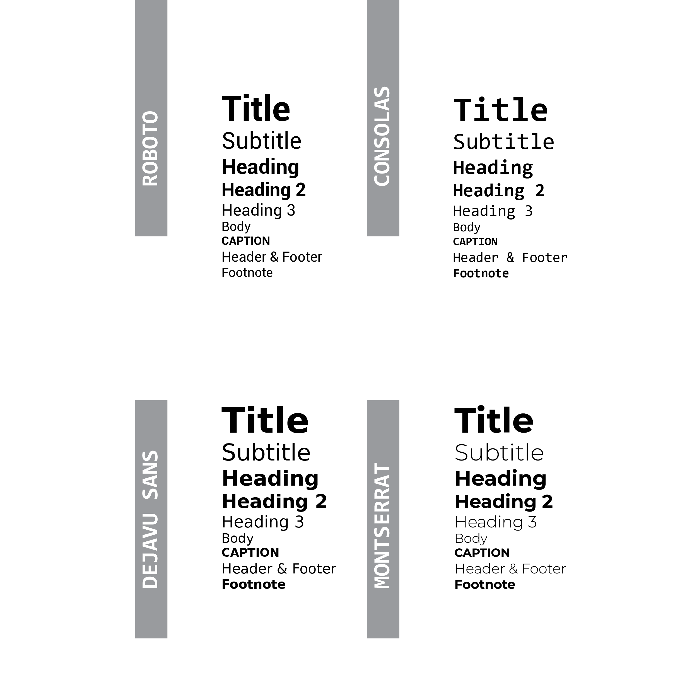
  </picture>

  

Our website wireframes can be found below. We've organized them with a first-time user in mind, ensuring a smooth flow as follows:

  -> Landing Page               | Ann opens the page using the URL   
  -> Registration/Login Page    | She decides to create an account   
  -> User Profile               | Ann checks how her profile appears to the public audience   
  -> User Profile Settings      | She decides to update some information about herself   
  -> Book Upload                | With a book to swap, Ann visits the Book Upload page and fills in the book data   
  -> Books Listing              | She explores books listed by others, looking for ones she's interested in buying/swapping   
  -> Book Details               | Ann finds 2 books intriguing but is unsure which to choose; she adds both to the Cart   
  -> Book Cart                  | Ann reviews the Cart, makes a final book selection, clicks to mark it, and proceeds to check shipping options   
  -> Shipping                   | She fills in her address, webiste calculates shipping cost, and Ann proceeds to the Payment Gateway   
  -> Payment Gateway            | She enters her payment details and receives payment confirmation   
  -> Rare Book Search           | A particular book crosses Ann's mind; she has been searching for it tirelessly. She decides to inquire about it on the Rare Book Search forum, in case someone is willing to give it away, swap, or sell.   

  <picture>
    <source width="1104" height="640" media="(prefers-color-scheme: dark)" srcset="./WireframesDesign/PNG/LandingPage_BW.png">
    <source width="1104" height="640" media="(prefers-color-scheme: light)" srcset="./WireframesDesign/PNG/LandingPage.png">
    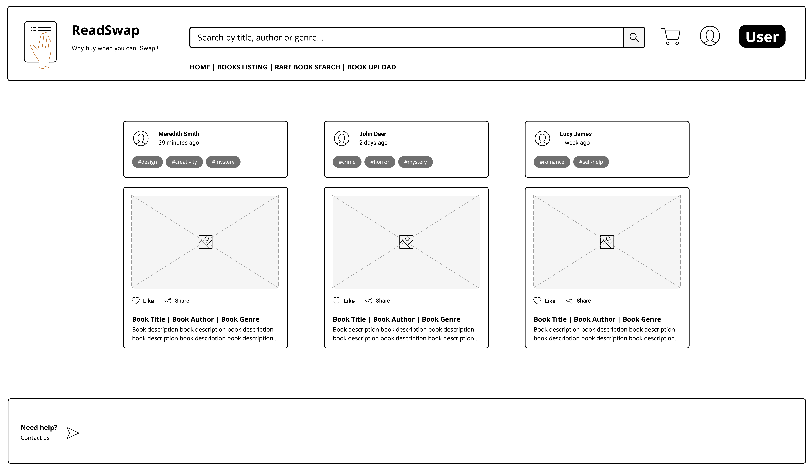
  </picture>

  

  <picture>
    <source width="1104" height="640" media="(prefers-color-scheme: dark)" srcset="./WireframesDesign/PNG/Registration-Login_BW.png">
    <source width="1104" height="640" media="(prefers-color-scheme: light)" srcset="./WireframesDesign/PNG/Registration-Login.png">
    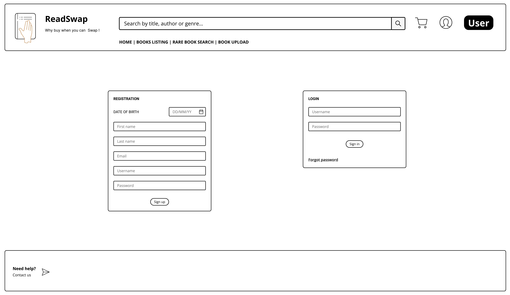
  </picture>

  

  <picture>
    <source width="1104" height="640" media="(prefers-color-scheme: dark)" srcset="./WireframesDesign/PNG/UserProfile_BW.png">
    <source width="1104" height="640" media="(prefers-color-scheme: light)" srcset="./WireframesDesign/PNG/UserProfile.png">
    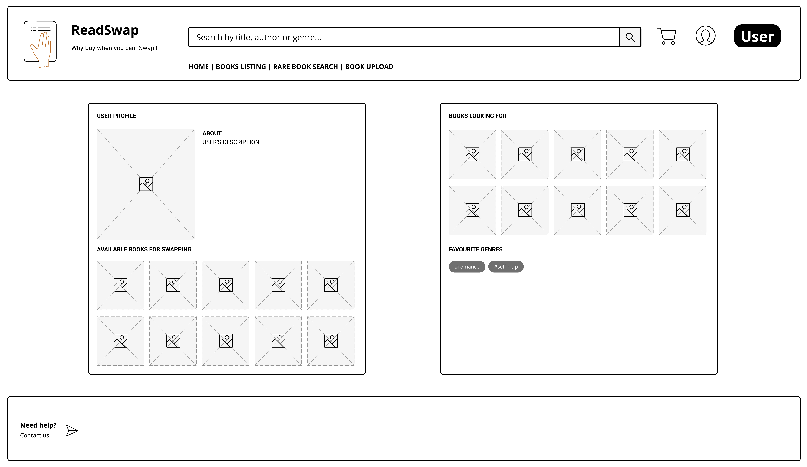
  </picture>

  

  <picture>
    <source width="1104" height="640" media="(prefers-color-scheme: dark)" srcset="./WireframesDesign/PNG/UserProfileSettings_BW.png">
    <source width="1104" height="640" media="(prefers-color-scheme: light)" srcset="./WireframesDesign/PNG/UserProfileSettings.png">
    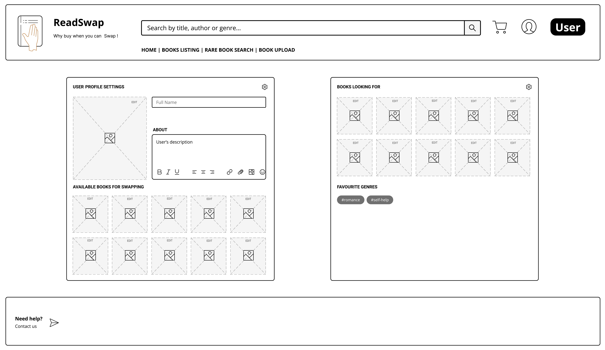
  </picture>

  

  <picture>
    <source width="1104" height="640" media="(prefers-color-scheme: dark)" srcset="./WireframesDesign/PNG/BookUpload_BW.png">
    <source width="1104" height="640" media="(prefers-color-scheme: light)" srcset="./WireframesDesign/PNG/BookUpload.png">
    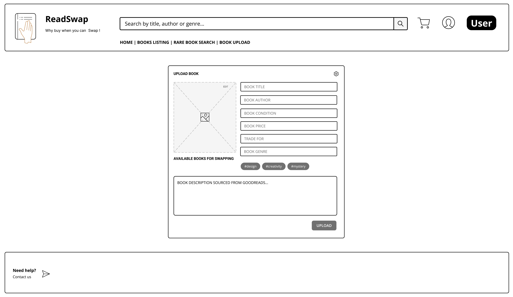
  </picture>

 

  <picture>
    <source width="1104" height="640" media="(prefers-color-scheme: dark)" srcset="./WireframesDesign/PNG/BooksListing_BW.png">
    <source width="1104" height="640" media="(prefers-color-scheme: light)" srcset="./WireframesDesign/PNG/BooksListing.png">
    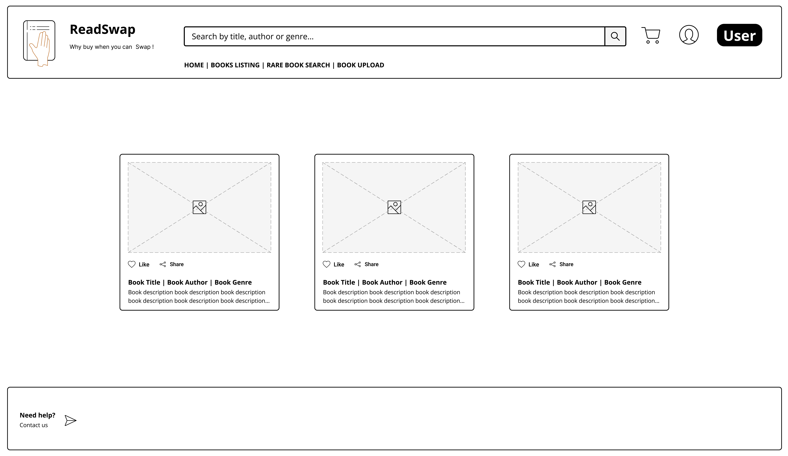
  </picture>

 

  <picture>
    <source width="1104" height="640" media="(prefers-color-scheme: dark)" srcset="./WireframesDesign/PNG/BookDetails_BW.png">
    <source width="1104" height="640" media="(prefers-color-scheme: light)" srcset="./WireframesDesign/PNG/BookDetails.png">
    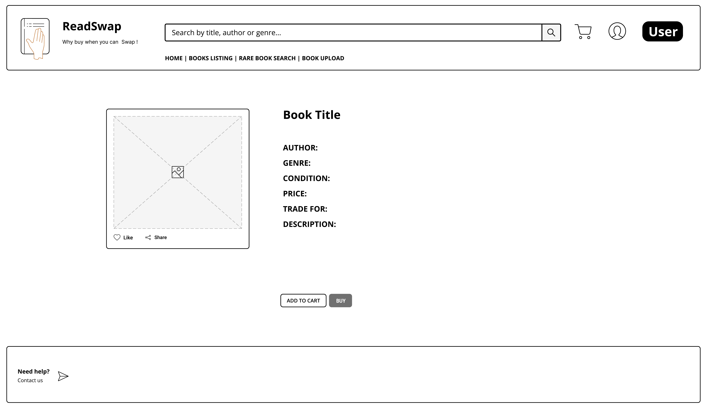
  </picture>

 

  <picture>
    <source width="1104" height="640" media="(prefers-color-scheme: dark)" srcset="./WireframesDesign/PNG/BookCart_BW.png">
    <source width="1104" height="640" media="(prefers-color-scheme: light)" srcset="./WireframesDesign/PNG/BookCart.png">
    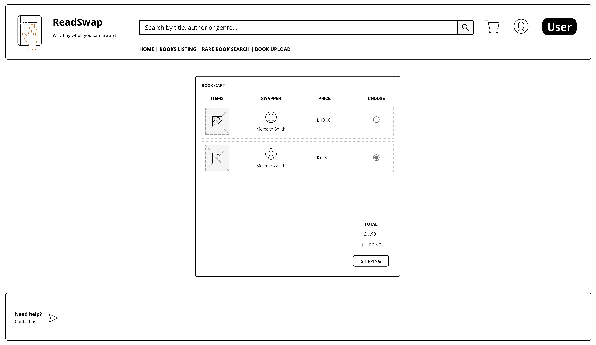
  </picture>

 

  <picture>
    <source width="1104" height="640" media="(prefers-color-scheme: dark)" srcset="./WireframesDesign/PNG/Shipping_BW.png">
    <source width="1104" height="640" media="(prefers-color-scheme: light)" srcset="./WireframesDesign/PNG/Shipping.png">
    
  </picture>

 

  <picture>
    <source width="1104" height="640" media="(prefers-color-scheme: dark)" srcset="./WireframesDesign/PNG/PaymentGateway_BW.png">
    <source width="1104" height="640" media="(prefers-color-scheme: light)" srcset="./WireframesDesign/PNG/PaymentGateway.png">
    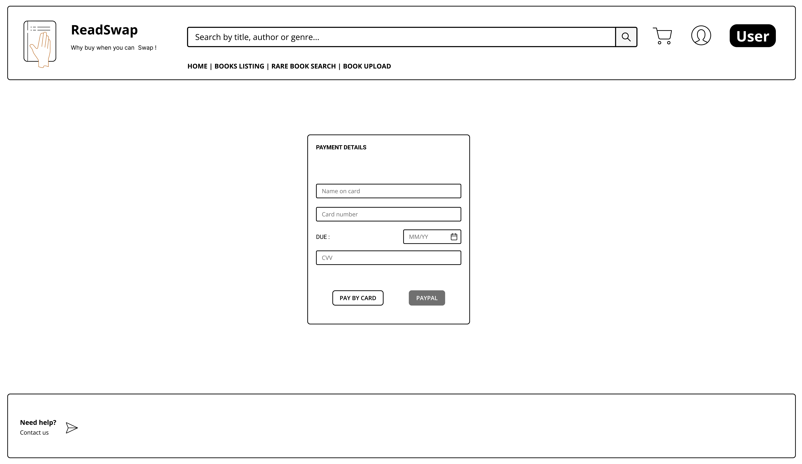
  </picture>

 

  <picture>
    <source width="1104" height="640" media="(prefers-color-scheme: dark)" srcset="./WireframesDesign/PNG/RareBookSearch_BW.png">
    <source width="1104" height="640" media="(prefers-color-scheme: light)" srcset="./WireframesDesign/PNG/RareBookSearch.png">
    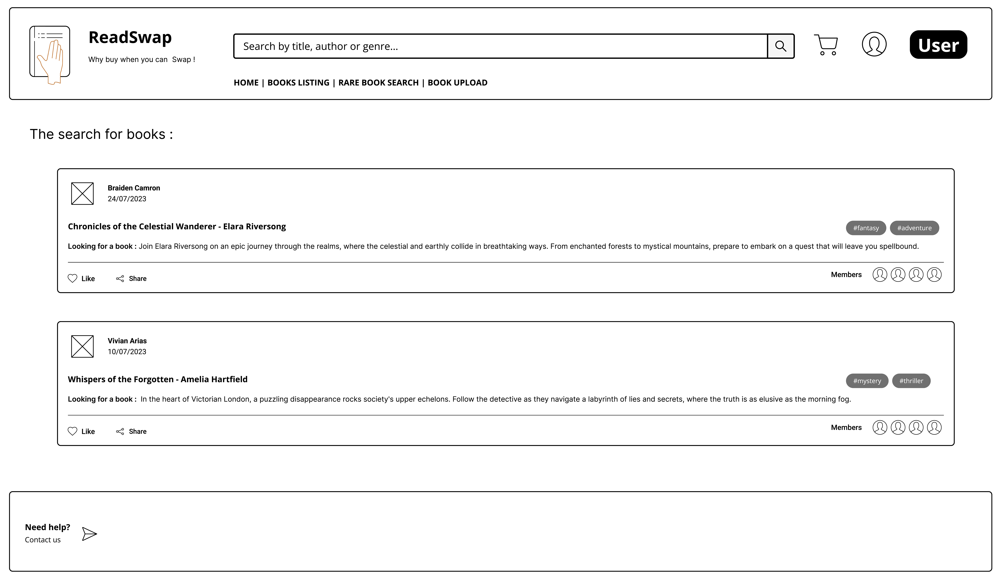
  </picture>

 

