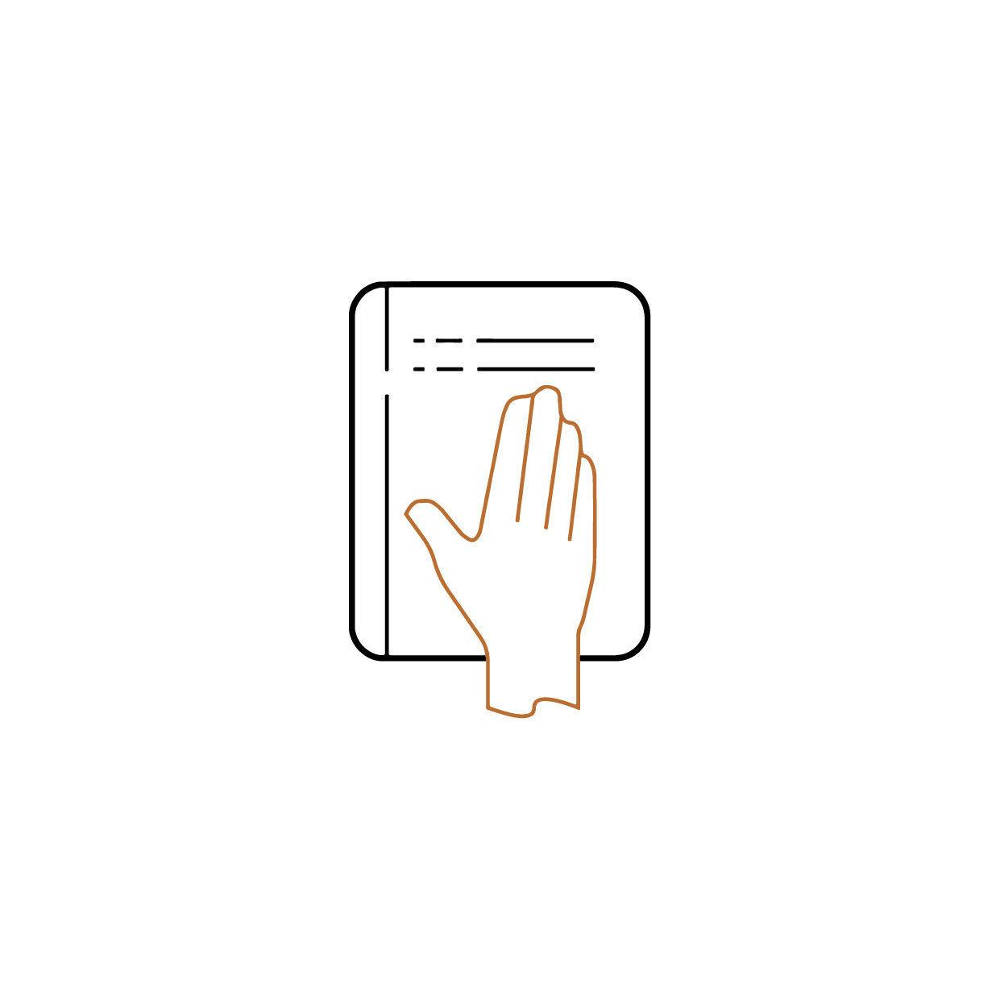

# CFGdegree - ReadSwap Project

## Problem Definition:
>In an era of increasing digital book readers, many individuals still treasure the tactile experience of flipping through the pages of beloved paper books. However, numerous books, despite being in good condition, remain idle, occupying valuable space after being read. Purchasing new books is not always environmentally friendly or economically feasible. This untapped potential for book exchange, sale, or donation creates a significant challenge for book enthusiasts.
>To address this issue, the ReadSwap emerges as the much-needed solution. The platform not only enables users to search for rare and out-of-print books but also facilitates the exchange, sale, or gifting of books that are no longer needed, gathering dust on their owners' shelves. By bridging the gap between book owners, the website encourages sustainable reading practices, minimises book waste, and fosters a vibrant community of book lovers who can share and enjoy the written word. With the ReadSwap, individuals can unlock the full potential of their book collections while indulging in the joy of discovering new literary treasures.

## Main Features:
- Book Exchange: Users can easily trade books with others, helping them discover new literary treasures while giving their own books a new life.
- Book Sale: ReadSwap allows users to sell their books to interested buyers, creating a marketplace for second-hand books.
- Book Gifting: Users can gift their books to others, spreading the joy of reading and promoting a culture of sharing.
- Rare Book Search: The platform offers a search feature to help users find rare and out-of-print books that may not be easily available elsewhere.
